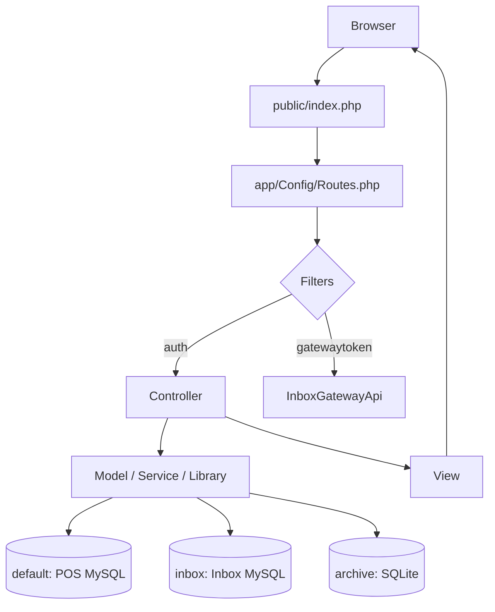
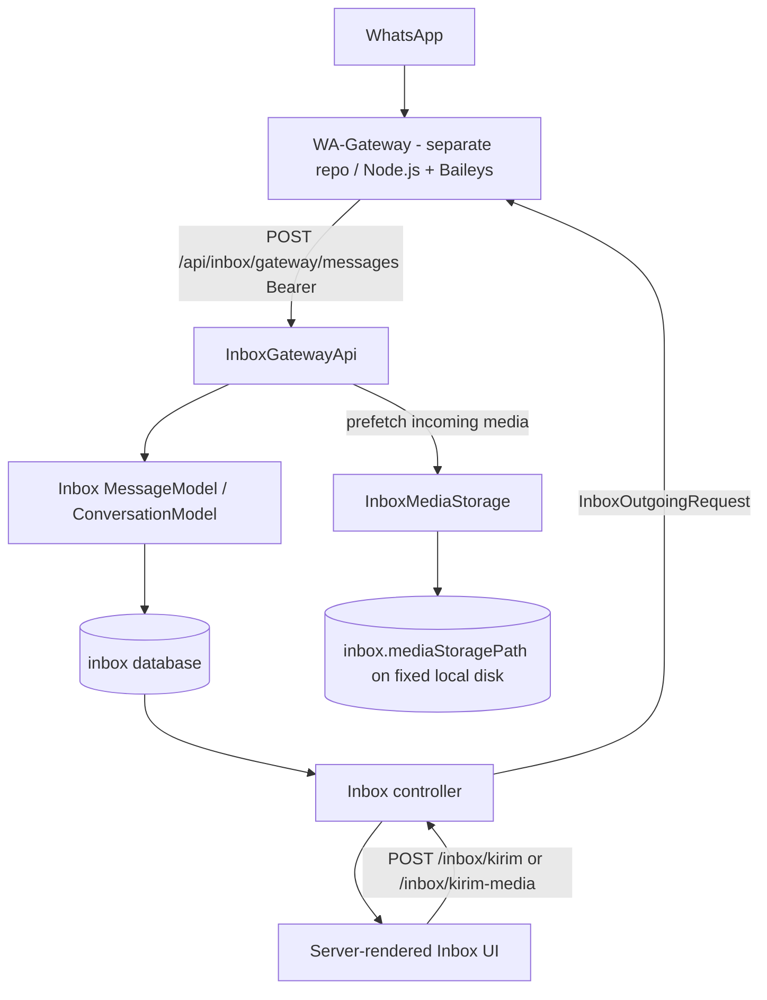

<!-- markdownlint-disable -->

# Architecture Documentation


This document serves as the canonical architectural map of the repository. It outlines the design
patterns, technical stack, directory structure, and module constraints to assist developers and AI
agents in navigating and maintaining the codebase safely.

Map basis: branch `v2.3` (local and `origin/v2.3` in sync), HEAD `f971042`, observed 2026-09-29.

> [!IMPORTANT]
> This map is an architectural reference, not a product specification. Feature behavior remains
> defined by the applicable PRD, specification, ADR, and implementation plan.

## 1. Project Overview

AuliaPos is a Point of Sale application for a single printing / photo / banner shop. It covers the
cashier flow, master data (products, categories, customers), transactions and payments, receivables
(tagihan), cash handling, employee scheduling, reports, and printing. Since the v2.2 line it also
carries a **Shared WhatsApp Inbox** module (multi-staff conversation handling) that talks to an
external WhatsApp Gateway.

- **Primary audience / users:** shop owner, admin, and cashier staff.
- **UI and domain language:** Indonesian (`transaksi`, `pelanggan`, `produk`, `kasir`, `tagihan`,
  `pembayaran`, `jadwal`, `percakapan`, `kutipan`, `teruskan`).
- **Primary goals:** run the daily shop counter reliably, keep a shared WhatsApp inbox usable by
  several staff at once, and keep POS and Inbox data separated.

## 2. High-Level Architecture & Tech Stack

| Concern | Current implementation |
| --- | --- |
| Primary language | PHP `^8.2` |
| Application framework | CodeIgniter 4 (`^4.7`), server-rendered MVC-style |
| Architectural pattern | Framework MVC plus explicit Service / Library seams; bounded Inbox module |
| Dependency management | Composer |
| Test framework | PHPUnit `^10.5.16` |
| Runtime document / print | `dompdf/dompdf` (`^3.1`), `mike42/escpos-php` (`^5.0`) |
| Web server | Apache via XAMPP (`http://localhost/aulia/`), document root `public/` |
| Primary database | MySQL/MariaDB via the `default` connection group |
| Inbox database | Separate MySQL/MariaDB connection group `inbox` |
| Archive database | Separate SQLite connection group `archive` |
| Test database | In-memory SQLite connection group `tests` (POS only); Inbox tests use the real MariaDB `aulia_inboxdb_test` |
| External system | WhatsApp Gateway (Node.js + Baileys) in a **separate repository**, reached over HTTP + Bearer token |

Layering is intentionally pragmatic rather than dogmatic:

- **Controllers** (`app/Controllers/`) own HTTP concerns, request validation, and orchestration.
- **Models** (`app/Models/`) own persistence and domain-oriented data access.
- **Services** (`app/Services/`) hold reusable, mostly pure application/domain logic.
- **Libraries** (`app/Libraries/`) hold reusable infrastructure and integration components.
- **Views** (`app/Views/`) hold server-rendered PHP UI; the Inbox has one large view plus
  client-side JavaScript.

## 3. Data Flow & Layer Dependencies

### 3.1 Browser request flow (POS and Inbox)



### 3.2 WhatsApp message flow (Inbox module)



### 3.3 Outgoing send idempotency

Outbound replies carry a caller-owned `operation_id` across the Gateway boundary, so a cashier retry
after a timeout does not deliver a second WhatsApp message:

- The reply form in `app/Views/inbox/index.php` mints the key with `crypto.randomUUID()` (hex
  fallback), reuses it while the cashier retries the same content, and discards it on success or when
  the content changes.
- AuliaPos forwards the key and stores it in `messages.gateway_operation_id` (nullable `VARCHAR(64)`
  with `UNIQUE uniq_messages_gateway_operation_id`). On a replayed Gateway result, the stored row is
  returned instead of inserting a second one.
- The Gateway owns the matching `outgoing_operations` state machine and answers `409
  SEND_IN_PROGRESS`, `504 SEND_UNRESOLVED`, or `409 OPERATION_ID_REUSED`; AuliaPos surfaces those as
  an "uncertain result" state instead of a plain failure.
- `App\Libraries\InboxOutgoingRequest` is the single value object for one outgoing Gateway request
  (text or media). It enforces `quoted` XOR `forward` exclusivity in one place (`CON-001`), replacing
  the parameter growth on `Inbox::callGatewaySend()` / `Inbox::callGatewaySendMedia()`.

### 3.4 Inbox HTTP surface

| Route | Responsibility |
| --- | --- |
| `GET /inbox` | Inbox page |
| `GET /inbox/api/conversations` | Conversation queue data (`page`, `status`, `q`, `match_snippet`) |
| `GET /inbox/api/conversations/(:num)/messages` | Conversation thread |
| `GET /inbox/api/gateway-status` | Gateway status |
| `GET /inbox/media/(:num)` | Media access (any logged-in staff; no `cekOwnership()` check) |
| `POST /inbox/kirim` | Send text reply (idempotent per `operation_id`; optional `quoted_message_id` / `forward_from_message_id`) |
| `POST /inbox/kirim-media` | Send media (idempotent per `operation_id`; same optional quote / forward fields) |
| `POST /inbox/percakapan/(:num)/ambil` | Take ownership |
| `POST /inbox/percakapan/(:num)/lepas` | Release ownership |
| `POST /inbox/percakapan/(:num)/tutup` | Close conversation |
| `POST /inbox/percakapan/(:num)/tandai-dibaca` | Mark conversation read |
| `POST /inbox/percakapan/(:num)/snooze` | Snooze conversation |
| `POST /inbox/percakapan/(:num)/catatan` | Add Internal Note |
| `POST /inbox/percakapan/(:num)/handoff` | Handoff ownership to another active kasir (conditional write + history) |
| `GET /inbox/percakapan/(:num)/handoff` | Handoff history for one conversation (newest-first, cap 50) |
| `POST /inbox/percakapan/(:num)/hapus` | Soft-delete conversation |
| `POST /inbox/percakapan/(:num)/profil` | Update customer profile |
| `POST /inbox/percakapan/(:num)/konfirmasi-nomor` | Confirm WhatsApp number |
| `POST /inbox/mulai-percakapan` | Start conversation (always a `pn` conversation) |
| `GET /inbox/api/perlu-dibalas-count` | Sidebar reply-needed count (excludes groups) |
| `POST /api/inbox/gateway/messages` | Gateway ingest (machine-to-machine, `gatewaytoken` filter) |
| `POST /api/inbox/gateway/status` | Gateway status ingest (machine-to-machine, `gatewaytoken` filter) |

## 4. Dependencies & External Services

- **MySQL/MariaDB (`default`)** — POS business data: users, products, categories, customers,
  transactions, payments, cash, scheduling.
- **MySQL/MariaDB (`inbox`)** — Inbox data: conversations, messages, handoffs, gateway status,
  conversation identities and identity reconciliation.
- **SQLite (`archive`)** — archived transactions (`writable/archive/aulia_pos_archive.db`).
- **WhatsApp Gateway (separate repository, Node.js + Baileys)** — the only way AuliaPos reaches
  WhatsApp. AuliaPos never talks to WhatsApp directly. Reached over HTTP with a Bearer token
  (`inbox.gatewayToken` in AuliaPos, `CI4_GATEWAY_TOKEN` in the Gateway). Its `/send` and
  `/send-media` endpoints accept an optional `quoted` object and a `forward` flag.
- **Local media disk (`inbox.mediaStoragePath`)** — permanent store for incoming images, documents
  and stickers. It is a fixed local disk outside the application directory (never a removable or
  network drive); an empty value deliberately disables the feature and falls back to live-fetch.
- **Composer packages** — `codeigniter4/framework`, `dompdf/dompdf`, `mike42/escpos-php`; dev:
  `phpunit/phpunit`, `fakerphp/faker`, `mikey179/vfsstream`.

## 5. Directory Tree Map

```text
aulia/  (project root)
├── .claude/                 # SINGLE source of AI config: rules/, skills/, standards/, instructions/
├── app/
│   ├── Commands/            # Application CLI commands (Spark)
│   ├── Config/              # Framework and application configuration (Inbox.php, Routes.php, Database.php, ...)
│   ├── Controllers/         # HTTP / application entry points (POS, Inbox, Gateway ingress, ...)
│   ├── Database/
│   │   ├── Migrations/      # Production schema migrations (POS + Inbox)
│   │   └── Seeds/           # Master / bootstrap data
│   ├── Filters/             # AuthFilter, GatewayTokenFilter
│   ├── Helpers/             # Shared procedural helpers (order_helper, cash_helper)
│   ├── Language/            # Framework / application language resources
│   ├── Libraries/           # Reusable infrastructure (InboxMediaStorage, InboxMediaBound, InboxOutgoingRequest, PhoneNumber, FotoProfilService)
│   ├── Models/              # Persistence and domain data access
│   ├── Services/            # Reusable application / domain services
│   ├── ThirdParty/          # Local third-party integration area
│   └── Views/               # Server-rendered UI (inbox/, kasir/, produk/, ...)
├── docs/                    # Business + technical docs
│   ├── adr/                 # Architecture Decision Records (NNNN-slug.md)
│   ├── audit/               # Clarification / consistency reports
│   ├── decisions/           # Dated decision records (YYYY-MM-DD-slug.md)
│   ├── runbooks/            # Operational runbooks
│   ├── tutorials/           # User-facing tutorials
│   └── ARCHITECTURE.md      # This map
├── plan/                    # Implementation plans
├── spec/                    # Technical specifications
├── prd-*.md                 # Product Requirements Documents (root)
├── public/                  # Web root and static assets; public/index.php is the prod entry
├── tests/
│   ├── database/            # DB / model / migration tests
│   ├── session/             # HTTP controller + session feature tests
│   ├── unit/                # Isolated service / calculation tests
│   ├── js/                  # Node-based JS behavior checks
│   └── _support/            # Test schema, fakes, fixtures, bootstrap
├── writable/                # Runtime caches, logs, uploads, archive SQLite
├── composer.json
├── phpunit.dist.xml
└── spark
```

## 6. Directory Purposes & Responsibilities

| Directory / File | Primary Purpose | Contains | Rules / Constraints |
| --- | --- | --- | --- |
| `app/Controllers/` | HTTP entry points and orchestration | Auth, Kasir, Produk, Kategori, Pelanggan, Transaksi, Pembayaran, Tagihan, Cash, Laporan, Jadwal, Inbox, InboxGatewayApi, ArchiveTransaksi, MigrasiManual, Api, Cetak, Ukuran, Profil, PreviewBanner | Keep reusable logic in Services; ownership/state checks live here. `Inbox.php` is the browser-facing Inbox controller. |
| `app/Models/` | Persistence and data access | UserModel, ProdukModel, KategoriModel, PelangganModel, TransaksiModel, DetailTransaksiModel, PembayaranModel, CashExpenseModel, CashOpnameModel, ClosingKasModel, JadwalModel, MasterJadwalModel, ConversationModel, MessageModel, ConversationHandoffModel, GatewayStatusModel, ConversationIdentityModel | Inbox models use the `inbox` DB group. `UserModel::daftarKasirAktif()` is the single source of the active-kasir list (Handoff dropdown, 409 owner naming, `belum_diambil` initiator check). |
| `app/Services/` | Reusable application / domain logic | InboxSlaService, InboxMatchSnippetService, InboxQuoteSnapshotService, SenderIdentityFormatter, EffectiveShiftLeaderService, EvaluasiJendelaKerjaShift, Authority, CashBalanceService, TransaksiArchiveService, KalkulasiStatusPembayaran, KalkulasiDiskonTransaksi, KalkulasiJatuhTempo | Prefer pure services (no DB / session / request access) for display and matching rules. |
| `app/Libraries/` | Reusable infrastructure and integration | InboxMediaStorage, InboxMediaBound, InboxOutgoingRequest, PhoneNumber, FotoProfilService | `InboxOutgoingRequest` enforces `quoted` XOR `forward` in one place. `InboxMediaBound::mbKeByte()` is the single MB→byte conversion (overflow-safe, policy ceiling). |
| `app/Views/` | Server-rendered UI | `inbox/index.php` plus POS views (`kasir/`, `produk/`, `transaksi/`, `layout/`, ...) | Inbox UI is concentrated in `app/Views/inbox/index.php`; the backend supplies computed presentation fields (queue status, SLA state, sender labels) so the frontend does not re-derive core rules. |
| `app/Database/Migrations/` | Production schema evolution | POS migrations + Inbox migrations (quotes, `is_forwarded`, handoffs, gateway operation id, group name, identity reconciliation) | Additive-only where possible. Inbox migrations declare `protected $DBGroup = 'inbox'`. FK child column types must match the parent exactly (MariaDB rule). |
| `app/Filters/` | HTTP auth / security | `AuthFilter` (session), `GatewayTokenFilter` (Bearer token) | Browser routes use `auth`; Gateway ingress uses `gatewaytoken`. |
| `app/Commands/` | Spark CLI commands | `SeedFase1ePerf`, `RepairTotalDibayar` | Guarded commands must refuse to run against a disallowed database. |
| `tests/` | Automated test suite | database, session, unit, js, `_support` | Inbox test DB is the real MariaDB `aulia_inboxdb_test`, never SQLite and never live. Never add suppressions or skips to force green. |
| `docs/` | Business + technical documentation | Numbered business docs, `CHAT.md`, `GATEWAY-REQUIREMENTS.md`, ADRs, audits, decisions, runbooks, tutorials, this map | Follow `.claude/standards/` for glossary and ADR format. |
| `plan/` | Implementation plans | Refactor / feature plans (`plan-*.md`) | English. One plan per workstream. |
| `spec/` | Technical specifications | `spec-*.md` + `spec-index.md` | Canonical contracts for implemented modules. |
| `prd-*.md` (root) | Product Requirements Documents | Inbox, Grup/Balas/Teruskan PRDs | Behavior-level, not implementation-level. |
| `public/` | Web root and static assets | `index.php`, assets, logos | Web server must point here; never expose the project root. |
| `writable/` | Runtime data | cache, debugbar, logs, uploads, archive SQLite + backups | Runtime-only; not source of truth. |
| `.claude/` | Single source of AI configuration | `rules/`, `skills/`, `standards/`, `instructions/` | No `.agents/` tree exists. All tools read this tree. |

## 7. Key Configuration Files

- `composer.json` — PHP `^8.2`, CodeIgniter `^4.7`, dompdf, escpos-php; dev PHPUnit / faker / vfsStream.
  PSR-4: `App\` → `app/`, `Config\` → `app/Config/`; migrations are excluded from the classmap.
  Test script: `test` → `phpunit`.
- `phpunit.dist.xml` — PHPUnit configuration. Sets `failOnWarning="true"` and coverage reporting; with
  no coverage driver installed, plain `composer test` exits non-zero for that reason alone.
- `.env` (git-ignored, not in source control) — `app.baseURL`, `database.default.*`, the `inbox.*`
  group (`inbox.gatewayToken`, `inbox.gatewayBaseUrl`, `inbox.mediaStoragePath`), and the media caps.
  Secrets never live in tracked files.
- `app/Config/Database.php` — connection groups `default`, `inbox`, `archive`, `tests`. Under
  `ENVIRONMENT === 'testing'`, the `default` group is redirected to in-memory SQLite and the `inbox`
  group is force-pinned to `aulia_inboxdb_test` (DSN / failover cleared so an `.env` entry cannot
  redirect it).
- `app/Config/Inbox.php` — Gateway token / base URL, heartbeat staleness, SLA thresholds, and the
  three media caps (`maxMediaUploadMb` 15, `maxMediaDownloadMb` 100, `maxMediaPrefetchMb` 15). Invalid
  env values fall back with a logged warning; `maxMediaPrefetchMb <= maxMediaDownloadMb` always holds.
- `app/Config/Routes.php` — all route registration and filter binding.
- `app/Config/Filters.php` — filter aliases, including `auth` and `gatewaytoken`.
- `spark` — CLI entry point (migrations, seeds, custom commands).
- `public/.htaccess` — front-controller rewrite; document root is `public/`.
- `preload.php` — optional opcache preload path list.
- `migrate.bat`, `jalankan_claude.bat` — local convenience scripts.

## 8. Entry Points

- **Web (production):** `public/index.php` → CodeIgniter bootstrap → `app/Config/Routes.php` → filter →
  controller → view.
- **CLI:** `spark` (e.g. `php spark migrate`, `php spark db:seed AuliaPosInitialSeeder`,
  `php spark aulia:seed-fase1e-perf --dbgroup=inbox`).
- **Routing:** `app/Config/Routes.php` — browser routes carry the `auth` filter; the two Gateway
  ingress routes carry `gatewaytoken`.
- **POS UI shell:** `app/Views/layout/main.php`.
- **Inbox UI:** `app/Views/inbox/index.php` (server-rendered page plus inline client-side JavaScript).

## 9. Environment & Deployment

- **Local runtime:** XAMPP on Windows (Apache + MySQL/MariaDB + PHP 8.2), served at
  `http://localhost/aulia/` with the web server pointed at `public/`. Required PHP extensions:
  `intl`, `mbstring`, `json`, `mysqlnd`, `curl`.
- **Setup:** `composer install`, copy `env` to `.env` and fill `baseURL` + `database.default.*`,
  `php spark migrate`, `php spark db:seed AuliaPosInitialSeeder`, `composer test`.
- **Inbox extra requirements:** a second database (`aulia_inboxdb`, group `inbox`) and the external
  WhatsApp Gateway. `inbox.mediaStoragePath` is optional; unset means live-fetch only.
- **CI/CD:** none in this repository. Deployment is manual (XAMPP folder for AuliaPos; the live
  Gateway folder is started by hand and has no supervisor).
- **Deployment ordering rule:** run a new Inbox migration **before** deploying code that reads/writes
  the new column. Example: `AddIsForwardedToMessages` must run before code that writes
  `messages.is_forwarded`, otherwise the write fails `Unknown column` → HTTP 500.
- **Test-database setup (one-time, Inbox):** create `aulia_inboxdb_test` schema-only from
  `aulia_inboxdb`. `php spark migrate` cannot build it (migration history lives in `default`). Re-run
  the schema dump whenever a new Inbox migration is added, or tests fail with unknown column/table.

## 10. Testing Strategy

- **Framework:** PHPUnit `^10.5.16` (plus Node-based `.check.js` behavior checks under `tests/js/`).
- **Layout:**
  - `tests/database/` — model / database / migration behavior.
  - `tests/session/` — HTTP controller + session feature tests.
  - `tests/unit/` — isolated services and calculations.
  - `tests/js/` — pure JavaScript behavior checks (run with Node, not PHPUnit).
  - `tests/_support/` — test schema, fakes, fixtures, bootstrap.
- **Run commands:**
  - `composer test` — invokes PHPUnit; may exit non-zero solely because of the pre-existing
    "No code coverage driver available" warning.
  - `vendor/bin/phpunit --no-coverage` — the exit-0 green/red signal.
- **Inbox test DB:** the real MariaDB `aulia_inboxdb_test`, never SQLite and never live. Every Inbox
  test `setUp()` empties tables, so run PHPUnit **sequentially** — never in parallel.
- **Manual performance DB:** `aulia_inboxdb_perf` (schema-only), seeded by the guarded command
  `php spark aulia:seed-fase1e-perf --dbgroup=inbox`, which refuses any DB whose name is not
  `aulia_inboxdb_perf`. It is deliberately not wired into `composer test` or CI.
- **Two-layer mandate:** every change ships incremental tests (micro), and the full suite must pass
  before a phase closes (macro). Suppressions, skipped tests, and deleted assertions are forbidden.
- **Suite size drifts every session that adds tests** — gate new work on "≥ the count measured
  immediately before the change + new tests", never on a frozen number.

## 11. AI Agent Boundaries

- **Single AI config root:** `.claude/` (`rules/`, `skills/`, `standards/`, `instructions/`). There is
  no `.agents/` tree; do not recreate one.
- **Session memory:** `.claude/instructions/memory.instructions.md`, managed by the `memory-manager`
  skill. Do not hand-edit unless necessary.
- **Documentation standards:** follow `.claude/standards/CONTEXT-FORMAT.md` and `ADR-FORMAT.md`.
  PRDs / audits are Indonesian; `plan/` documents and `REMEDIATION STATUS` blocks are English.
- **This mapping skill changes no source code.** Its only outputs are `docs/ARCHITECTURE.md` and
  optional references in `AGENTS.md` / `README.md`.
- **Preserve the Inbox database boundary.** Inbox persistence must never accidentally use the POS
  `default` group.
- **The architectural constraints listed in §13 are locked:** the M2 State Consistency program stays
  deferred; the M2 gate was opened narrowly for Handoff only and must not expand silently.
- **Never render a raw JID in the UI.** Sender identity is derived by `SenderIdentityFormatter`.
- **No suppressions.** Never add `@ts-ignore`, `eslint-disable`, or `# noqa`, and never skip or delete
  tests to force a build green.
- **Ownership atomicity:** only the take path (`ambilPercakapan()`) and Handoff use an expected-owner
  conditional write; `lepas`, `tutup`, `snooze`, `tandai-dibaca`, `hapus` remain application-level
  read-then-write logic unless a spec says otherwise.

## 12. Database Topology

AuliaPos intentionally uses multiple database groups.

```text
                    ┌──────────────────────┐
                    │   CodeIgniter App    │
                    └──────────┬───────────┘
                               │
          ┌────────────────────┼─────────────────────┐
          ▼                    ▼                     ▼
   default / POS          inbox / Inbox        archive / SQLite
   MySQL/MariaDB          MySQL/MariaDB         SQLite file
          │                    │                     │
   POS business data     Conversations,          Archived
   and transactions      messages, gateway       transactions
                         status, identity
                         and handoffs

                    tests / PHPUnit
                         SQLite :memory:
```

Under `ENVIRONMENT === 'testing'` the redirects are:

- `default` → the `tests` group (SQLite `:memory:`);
- `inbox` → the real MariaDB `aulia_inboxdb_test` (database name forced; `DSN` and `failover`
  cleared so an `.env` entry cannot redirect the connection).

Both redirects live in `app/Config/Database.php`. In addition, `tests/_support/bootstrap.php` refuses
to start PHPUnit if the `inbox` group does not resolve to `aulia_inboxdb_test`.

Production migrations live in `app/Database/Migrations/`; test-only schema support lives in
`tests/_support/Database/Migrations/`.

## 13. Shared WhatsApp Inbox Module Architecture

The Inbox is a bounded application module inside AuliaPos with an external WhatsApp Gateway. Its
runtime data flow is shown in §3.2 and its HTTP surface in §3.4. This section records the module's
seams and locked constraints.

### 13.1 Queue status

Queue status is computed centrally by `ConversationModel::withComputedStatus()`, which is a thin layer
over the existing `attachResponseState()` (ADR-0001). It deliberately reuses the response-state
computation instead of introducing independent SQL `WHERE` logic for queue tabs, so the sidebar badge
and the Queue View tabs cannot drift.

### 13.2 Internal Notes

Internal Notes are persisted as messages with `is_internal = true`. They do not call the WhatsApp
Gateway, do not mutate conversation `last_message_at` or `last_message_direction`, and remain part of
the conversation thread. They are allowed on closed conversations (no status gate).

### 13.3 SLA

`InboxSlaService` is a DB/session-independent calculation service. Its thresholds come from
`Config\Inbox` (`slaGreenMinutes` / `slaYellowMinutes`), never hardcoded. Only `selesai` and
`follow_up` (snoozed) states are excluded from the SLA indicator; `menunggu_customer` is included.

### 13.4 Handoff and Collision Detection

Handoff moves conversation ownership between staff and records every transfer in
`conversation_handoffs` (Inbox DB group).

- The ownership write is an expected-owner conditional write
  (`SET assigned_to = :to WHERE id = :id AND assigned_to <=> :expected`): a request that loses the
  race changes nothing and answers `409` with the current owner's name.
- The ownership write and the history insert share one `inbox`-group transaction, so a failed history
  insert rolls the ownership change back.
- History is read back through `GET /inbox/percakapan/(:num)/handoff` (auth filter only, newest-first,
  capped at 50); the message thread endpoint is untouched and `messages` is never written by Handoff.
- Staff-facing names are resolved in the Inbox UI from the same active-kasir list the Handoff dialog
  uses (`UserModel::daftarKasirAktif()`), because the read contract carries user ids only.
- Collision detection is **write-time conflict only**; Presence is deferred.

### 13.5 Media read authorization

Per `spec/spec-design-inbox-read-authorization.md` REQ-002, `Inbox::media()` performs no
`cekOwnership()` check: any logged-in staff member may read the media attachment of any conversation.

- The conversation `404` lookup is retained.
- The `410` / `media_confirmed_gone_at` write path is triggerable by any logged-in staff (it records
  an objective fact and only prevents repeated Gateway calls).
- `GET /inbox/api/conversations/(:num)/messages` (`Inbox::apiMessages()`) remains untouched and must
  never gain a `cekOwnership()` guard (SEC-001) — the thread read is as open as media read.

### 13.6 Media failure contract and local storage

`GET /inbox/media/(:num)` serves a message's attachment in two steps: first the local copy recorded
in `messages.media_local_filename`, falling through to a live Gateway fetch
(`POST /media/download`) only when that file is missing or unreadable.

| Status | Meaning | Client behaviour |
| --- | --- | --- |
| `200` | Decrypted binary, `Content-Type` from stored mimetype | Serve |
| `410` | The media host explicitly stated the media is gone (sets `media_confirmed_gone_at`) | Permanent; never retried |
| `503` | Temporary: Gateway or media host refused this attempt | Retryable, bounded |
| `504` | The Gateway download deadline expired (`config.mediaDownloadTimeoutMs`) | Retryable, bounded |
| `502` | The Gateway could not be reached at all | Retryable, bounded |

Only an explicit `410` from the media host is permanent. Expired signed URL, corrupted signature, and
missing object are indistinguishable (all `403` from the media host), so none of them is treated as
expiry (see `docs/decisions/2026-09-28-inbox-media-not-expired-and-failure-classification.md`).

**Local copy.** Incoming media is prefetched and stored by `InboxGatewayApi::messages()` through
`InboxMediaStorage`, under `inbox.mediaStoragePath` on a fixed local disk outside the application
directory. Prefetch runs with an 8-second budget inside the webhook response and is best-effort: a
failure leaves `media_local_filename` NULL and live-fetch still works. There is deliberately no
retention or pruning.

**Media size bounds (`Config\Inbox`).** Three independent axes, each read from `.env` with a clamped
fallback:

- `inbox.maxMediaUploadMb` — outgoing uploads the cashier sends (default `15`).
- `inbox.maxMediaDownloadMb` — incoming media served or displayed via `GET /inbox/media/(:num)`
  (default `100`).
- `inbox.maxMediaPrefetchMb` — ingest prefetch during the incoming-message webhook, the untrusted
  path that buffers + decrypts + writes to disk (default `15`). Its upper bound follows
  `maxMediaDownloadMb`, so `maxMediaPrefetchMb <= maxMediaDownloadMb` always holds.

`App\Libraries\InboxMediaBound::mbKeByte()` is the single MB→byte conversion used by all three paths.
It is overflow-safe and clamps to a policy ceiling, so an absurd env value cannot turn every media
request into `500`. Never reuse the upload cap as a download/display cap.

**Client-side failure handling (`app/Views/inbox/index.php`).** Two memories keyed by
`String(message.id)`: `mediaGagal` (permanent, `410`) and `mediaSementara` (temporary, retried at
most 3 times with a minimum 30-second gap). Transient entries are cleared when the Gateway
transitions to `connected`; entries flagged `nonRetryable` (deterministic `413` "terlalu besar") are
retained. When the Gateway is known to be down, the renderer emits no `` at all and shows a
distinct "Gateway terputus" placeholder.

### 13.7 Balas Pesan (Reply with Quote)

Reply-with-Quote introduces these seams:

- **Snapshot immutability (REQ-007):** quote data is copied once into the 7 `quoted_*` columns on the
  new message row (`quoted_wa_message_id`, `quoted_source_message_id`, `quoted_media_available`,
  `quoted_media_type`, `quoted_sender_label`, `quoted_snippet`, plus the runtime-only `fromMe`
  derivation). It is never re-derived from the source message at render time, so the quote survives
  source edits or soft-deletes. There is no `quoted_from_me` column.
- **Single builder:** `InboxQuoteSnapshotService::rakitSnapshot()` is the only place that populates
  `quoted_*`; both cashier replies (`Inbox::kirimKeConversation()`, `Inbox::kirimMedia()`) and inbound
  webhook processing (`InboxGatewayApi::resolveKutipanMasuk()`) call it.
- **Ownership check ordering (SEC-001):** `cekOwnership()` runs before quote resolution on the media
  path, and the same ordering is enforced on the text path so a non-owner cannot use the endpoint as
  an existence oracle.
- **Display branches (AC-005):** quote box renders per media availability — text-only, image/sticker
  live-fetch, document link, audio/video label only, or legacy/no-source. Client `mediaGagal` memory
  keyed `'kutipan:' + messageId` prevents repeated refetch polling on failure.
- **Snippet normalization (SEC-003):** local and Gateway fallback snippets pass through
  `potongSnippet()` (whitespace normalization, multibyte-safe bound, ellipsis); non-string payloads
  are coerced to a generic label without throwing.

### 13.8 Teruskan (Forward)

- Request body may carry `forward_from_message_id` (local `messages.id` of the source row). It is
  **mutually exclusive** with `quoted_message_id` in one request (`400`, CON-001).
- The server reads the content from its own DB (`Inbox::resolveTeruskan()`), never from the browser
  payload, and enforces forwardability server-side: internal notes, unsent outgoing rows,
  `audio`/`video`, and any type outside `text|image|document|sticker` are rejected with `400`.
  `cekOwnership()` is checked on the **target** conversation only (REQ-007).
- The forwarded result is a **new** `messages` row in the target conversation with `is_forwarded = 1`
  and all `quoted_*` columns NULL (REQ-009). The Gateway call carries `forward: true` and never
  `quoted`. The cashier label is built from `is_forwarded`, independent of the Gateway's
  `forward_marker_applied` debug field.
- `messages.is_forwarded` is `TINYINT(1) NOT NULL DEFAULT 0` (migration
  `2026-09-28-000001_AddIsForwardedToMessages`, additive-only, no index/FK), following the Inbox
  `tinyint(1)` precedent; older rows become "not forwarded" without backfill.
- Idempotency reuses the existing `operation_id` / `gateway_operation_id` mechanism (REQ-010).
- **ADR-0002:** the source-conversation ownership gap is an accepted, recorded risk; adding a source
  ownership guard would contradict REQ-007 / AC-004 and must supersede the ADR first.

### 13.9 Grup (Group conversations)

- `conversations.jid_type` (`VARCHAR(20)`) classifies the chat: `pn`, `lid`, `group`, `unknown`.
  `conversations.group_name` (migration `2026-09-26-000001_AddGroupNameToConversations`) stores the
  group title when the Gateway supplies it.
- Inbound **group** messages must carry `messages.sender_jid` (from the Gateway's `key.participant`):
  `InboxGatewayApi::messages()` rejects a group incoming message with an empty `sender_jid` (`400`).
  Non-group and outgoing rows are unaffected.
- `App\Services\SenderIdentityFormatter::labelFor()` is the pure, single source of sender-label rules.
  It never returns a raw JID: `@s.whatsapp.net` → clean phone number (numeric-only local part, device
  suffix stripped), `@lid` / `*.lid` → the literal `LID`, group domain `@g.us` → `null` (no label at
  all, for legacy rows), anything else → `Pengirim`.
- Group-aware gates: Handoff and Tandai-Dibaca carry a group guard (SEC-01); the `perlu_dibalas`
  sidebar count excludes `jid_type = 'group'`; `mulaiPercakapan` always creates a `pn` conversation.
- Group support spans both repositories: sender identity, group title, quote, and forward all require
  the WA-Gateway change; separating groups in the list and fixing the sidebar badge are AuliaPos-only.

### 13.10 Conversation search

`GET /inbox/api/conversations` accepts `page`, `status`, and `q`. `q` matches the identity columns
(`contact_name`, `whatsapp_name`, `phone`, `manual_phone`, `chat_id`) and the message text, through one
aggregate `messages` query per request (`ROW_NUMBER()` over `message_timestamp DESC, id DESC`, `LIKE`
with an explicit `ESCAPE`), so no `messages` query runs when `q` is empty. Every conversation element
carries `match_snippet`: `null` when there is no `q` or when the hit came through an identity column,
otherwise `{ text, is_internal, message_timestamp }` cut by `InboxMatchSnippetService::potong()`.

### 13.11 Locked constraints

- Ownership is represented on the conversation and is already used by existing Inbox actions.
- Ownership checking on the remaining paths (`lepas`, `tutup`, `snooze`, `tandai-dibaca`, `hapus`) is
  still application-level read-then-write logic; only the take path and Handoff use an expected-owner
  conditional write.
- M2 State Consistency is deferred. M3 Phase 2a opened the M2 gate **narrowly** (Handoff only) and
  must not silently expand into a general state-consistency redesign.
- The separate Inbox database boundary must be preserved.
- Gateway behavior is out of scope unless an approved specification explicitly requires it.
- New architectural modules, directories, or API contracts introduced by implementation must be
  reflected in this document.

## 14. Architecture Change Policy

This document must be updated whenever implementation introduces:

- a new architectural module or directory;
- a new persistent integration boundary;
- a new API contract;
- a new database boundary;
- a significant ownership / state-management seam.

Routine changes inside an already documented module do not require restructuring this document unless
they materially change the architecture. Per the Living Architecture Map Mandate, keep it evergreen
during `/sdlc-write-code` completion or code review.

## 15. Relevant Architectural Files

| Area | Primary files |
| --- | --- |
| Routing | `app/Config/Routes.php` |
| Database topology | `app/Config/Database.php` |
| Inbox configuration | `app/Config/Inbox.php` |
| Inbox controller | `app/Controllers/Inbox.php` |
| Gateway controller | `app/Controllers/InboxGatewayApi.php` |
| Conversation persistence | `app/Models/ConversationModel.php` |
| Handoff persistence | `app/Models/ConversationHandoffModel.php` |
| Message persistence | `app/Models/MessageModel.php` |
| User persistence | `app/Models/UserModel.php` (`daftarKasirAktif()` = single source of active-kasir list) |
| Inbox SLA | `app/Services/InboxSlaService.php` |
| Inbox match snippet | `app/Services/InboxMatchSnippetService.php` |
| Inbox quote snapshot | `app/Services/InboxQuoteSnapshotService.php` |
| Sender identity label | `app/Services/SenderIdentityFormatter.php` |
| Inbox media storage | `app/Libraries/InboxMediaStorage.php` |
| Inbox media bound | `app/Libraries/InboxMediaBound.php` |
| Outgoing request value object | `app/Libraries/InboxOutgoingRequest.php` |
| Inbox UI | `app/Views/inbox/index.php` |
| Architecture decisions | `docs/adr/` (e.g. `0001-reuse-response-state-for-queue-view-status.md`, `0002-teruskan-source-visibility-risk-acceptance.md`) |
| Production migrations | `app/Database/Migrations/` |
| Test support | `tests/_support/` |
| Database tests | `tests/database/` |
| Session tests | `tests/session/` |
| Unit tests | `tests/unit/` |
| JS behavior checks | `tests/js/` |
